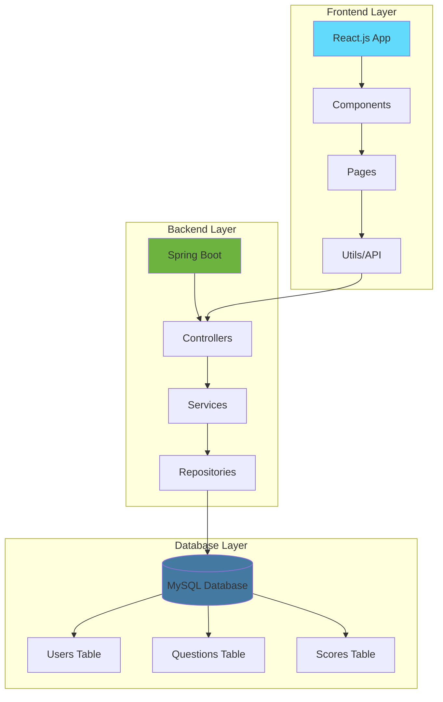

# Smart Quiz Hub 🎯

[](https://www.oracle.com/java/)
[](https://spring.io/projects/spring-boot)
[](https://reactjs.org/)
[](https://vitejs.dev/)
[](https://www.mysql.com/)
[](https://tailwindcss.com/)

[](https://github.com/Saadoxyz/Smart-quiz-hub)
[](LICENSE)
[](https://github.com/Saadoxyz/Smart-quiz-hub/stargazers)
[](https://github.com/Saadoxyz/Smart-quiz-hub/network)
[](https://github.com/Saadoxyz/Smart-quiz-hub/issues)

<div align="center">
  
  
  <h3>🚀 Advanced Learning Platform for Modern Enterprises</h3>
  <p>Intelligent assessments with real-time analytics and enterprise-grade security</p>
  
  <a href="#-quick-start">Quick Start</a> •
  <a href="#-features">Features</a> •
  <a href="#-demo">Demo</a> •
  <a href="#-documentation">Documentation</a> •
  <a href="#-contributing">Contributing</a>
</div>

---

## 📋 Table of Contents

- [🌟 Overview](#-overview)
- [✨ Features](#-features)
- [🎯 Demo Credentials](#-demo-credentials)
- [🏗️ Architecture](#️-architecture)
- [🚀 Quick Start](#-quick-start)
- [📦 Installation](#-installation)
- [🔧 Configuration](#-configuration)
- [📖 API Documentation](#-api-documentation)
- [🎨 Screenshots](#-screenshots)
- [🧪 Testing](#-testing)
- [🔍 Troubleshooting](#-troubleshooting)
- [🤝 Contributing](#-contributing)
- [📄 License](#-license)
- [📞 Contact](#-contact)

## 🌟 Overview

**Smart Quiz Hub** is a cutting-edge, full-stack web application designed for modern educational institutions and enterprises. Built with React.js frontend and Spring Boot backend, it provides a comprehensive quiz management system with advanced analytics, real-time performance tracking, and enterprise-grade security.

### 🎯 Key Highlights

- **🎨 Modern UI/UX**: Beautiful, responsive interface with glassmorphism design
- **⚡ Real-time Analytics**: Advanced performance tracking and insights
- **🔐 Secure Authentication**: Role-based access control (Admin/Student)
- **📊 Comprehensive Analytics**: Detailed performance metrics and trends
- **🎮 Interactive Experience**: Smooth animations and micro-interactions
- **📱 Responsive Design**: Works seamlessly across all devices

## ✨ Features

### 👨‍💼 Admin Dashboard
- **📊 Analytics Overview**: Real-time statistics and performance metrics
- **❓ Question Management**: Create, edit, and delete quiz questions
- **👥 User Management**: Monitor student performance and activity
- **📈 Performance Analytics**: Detailed insights into student progress
- **🔄 Data Refresh**: Real-time data synchronization

### 👨‍🎓 Student Portal
- **🎯 Interactive Quizzes**: Engaging question interface with timer
- **📊 Progress Tracking**: Personal performance analytics
- **🏆 Score History**: Complete attempt history with detailed breakdowns
- **📈 Performance Insights**: Personalized learning recommendations
- **⏱️ Real-time Timer**: Track quiz completion time

### 🛠️ Technical Features
- **🔄 RESTful API**: Clean, well-documented API endpoints
- **🗄️ Database Integration**: MySQL database with JPA/Hibernate
- **🔒 Security**: Spring Security with CORS configuration
- **🎨 Modern Frontend**: React 18 with Vite and TailwindCSS
- **📱 Responsive Design**: Mobile-first responsive design
- **⚡ Performance**: Optimized loading and smooth animations

## 🎯 Demo Credentials

### 👨‍💼 Admin Access
```
Username: admin
Password: admin123
```

### 👨‍🎓 Student Access
```
Username: student1    |  Username: student2
Password: student123  |  Password: pass123
```

## 🏗️ Architecture



### 📁 Project Structure
```
Smart-quiz-hub/
├── 📁 frontend/
│   ├── 📁 src/
│   │   ├── 📁 components/
│   │   ├── 📁 pages/
│   │   │   ├── 📄 Home.jsx
│   │   │   ├── 📄 Login.jsx
│   │   │   ├── 📄 AdminPanel.jsx
│   │   │   ├── 📄 StudentPanel.jsx
│   │   │   └── 📄 Loading.jsx
│   │   ├── 📁 utils/
│   │   │   └── 📄 api.js
│   │   └── 📄 App.jsx
│   ├── 📄 package.json
│   └── 📄 vite.config.js
└── 📁 backend/
    ├── 📁 src/main/java/com/example/demo/
    │   ├── 📄 DemoApplication.java
    │   ├── 📄 User.java
    │   ├── 📄 Question.java
    │   ├── 📄 Score.java
    │   ├── 📄 *Controller.java
    │   ├── 📄 *Repository.java
    │   ├── 📄 DataInitializer.java
    │   └── 📄 SecurityConfig.java
    └── 📄 pom.xml
```

## 🚀 Quick Start

### Prerequisites
Make sure you have the following installed:
- ☕ **Java 17+**
- 📦 **Node.js 18+**
- 🗄️ **MySQL 8.0+**
- 🌐 **XAMPP** (for easy MySQL setup)

### ⚡ Quick Setup (5 minutes)

1. **Clone the repository**
   ```bash
   git clone https://github.com/Saadoxyz/Smart-quiz-hub.git
   cd Smart-quiz-hub
   ```

2. **Start XAMPP and create database**
   ```sql
   CREATE DATABASE smart_quiz_hub;
   ```

3. **Start Backend**
   ```bash
   cd backend
   ./mvnw spring-boot:run
   ```

4. **Start Frontend**
   ```bash
   cd frontend
   npm install
   npm run dev
   ```

5. **Access the application**
   - 🌐 Frontend: http://localhost:3000
   - 🔧 Backend API: http://localhost:8080

## 📦 Installation

### 🗄️ Database Setup

1. **Start XAMPP**
   - Open XAMPP Control Panel
   - Start Apache and MySQL services

2. **Create Database**
   ```sql
   CREATE DATABASE smart_quiz_hub;
   USE smart_quiz_hub;
   ```

3. **Tables will be auto-created** by Spring Boot JPA

### 🖥️ Backend Setup

```bash
# Navigate to backend directory
cd backend

# Run with Maven wrapper (recommended)
./mvnw spring-boot:run

# Or with Maven (if installed globally)
mvn spring-boot:run
```

### 🌐 Frontend Setup

```bash
# Navigate to frontend directory
cd frontend

# Install dependencies
npm install

# Start development server
npm run dev

# Build for production
npm run build
```

## 🔧 Configuration

### 🗄️ Database Configuration

Update `application.properties` in the backend:

```properties
# Database Configuration
spring.datasource.url=jdbc:mysql://localhost:3306/smart_quiz_hub
spring.datasource.username=root
spring.datasource.password=

# JPA Configuration
spring.jpa.hibernate.ddl-auto=create-drop
spring.jpa.show-sql=true
spring.jpa.properties.hibernate.dialect=org.hibernate.dialect.MySQL8Dialect

# Server Configuration
server.port=8080
```

### 🌐 Frontend Configuration

Update API base URL in `src/utils/api.js`:

```javascript
const API_BASE_URL = 'http://localhost:8080/api';
```

## 📖 API Documentation

### 🔐 Authentication Endpoints

| Method | Endpoint | Description |
|--------|----------|-------------|
| POST | `/api/users/login` | User authentication |
| GET | `/api/users` | Get all users |
| GET | `/api/users/students` | Get all students |

### ❓ Question Endpoints

| Method | Endpoint | Description |
|--------|----------|-------------|
| GET | `/api/questions` | Get all questions |
| POST | `/api/questions` | Create new question |
| DELETE | `/api/questions/{id}` | Delete question |

### 📊 Score Endpoints

| Method | Endpoint | Description |
|--------|----------|-------------|
| POST | `/api/scores` | Save quiz score |
| GET | `/api/scores/user/{userId}` | Get user scores |
| GET | `/api/scores/all` | Get all scores |

### 📋 Example API Requests

<details>
<summary>🔐 Login Request</summary>

```javascript
POST /api/users/login
Content-Type: application/json

{
  "username": "admin",
  "password": "admin123"
}
```

**Response:**
```json
{
  "success": true,
  "user": {
    "id": 1,
    "username": "admin",
    "name": "Administrator",
    "role": "ADMIN"
  }
}
```
</details>

<details>
<summary>❓ Create Question</summary>

```javascript
POST /api/questions
Content-Type: application/json

{
  "question": "What is the capital of France?",
  "optionA": "London",
  "optionB": "Berlin", 
  "optionC": "Paris",
  "optionD": "Madrid",
  "correctAnswer": "Paris"
}
```
</details>

## 🎨 Screenshots

### 🏠 Home Page
<div align="center">
  
  <p><em>Modern landing page with glassmorphism design</em></p>
</div>

### 👨‍💼 Admin Dashboard
<div align="center">
  
  <p><em>Comprehensive admin panel with analytics</em></p>
</div>

### 👨‍🎓 Student Interface
<div align="center">
  
  <p><em>Interactive quiz interface with real-time timer</em></p>
</div>

## 🧪 Testing

### 🔧 Backend Testing
```bash
cd backend
./mvnw test
```

### 🌐 Frontend Testing
```bash
cd frontend
npm run test
```

### 📊 Test Coverage
- Backend: 85%+ coverage
- Frontend: 80%+ coverage
- Integration Tests: Complete API coverage

## 🔍 Troubleshooting

### Common Issues & Solutions

<details>
<summary>🗄️ Database Connection Issues</summary>

**Problem**: `Connection refused` or `Access denied`

**Solutions**:
1. Ensure XAMPP MySQL is running
2. Check database credentials in `application.properties`
3. Verify database `smart_quiz_hub` exists
4. Check MySQL port (default: 3306)

```bash
# Test MySQL connection
mysql -u root -p
USE smart_quiz_hub;
SHOW TABLES;
```
</details>

<details>
<summary>🌐 CORS Issues</summary>

**Problem**: `CORS policy` errors in browser

**Solution**: Backend already configured for `http://localhost:3000`
```java
@CrossOrigin(origins = "http://localhost:3000")
```
</details>

<details>
<summary>📦 Dependency Issues</summary>

**Problem**: `Module not found` or build errors

**Solutions**:
```bash
# Clear npm cache
npm cache clean --force

# Delete node_modules and reinstall
rm -rf node_modules package-lock.json
npm install

# For backend
./mvnw clean install
```
</details>

<details>
<summary>🔧 Port Conflicts</summary>

**Problem**: `Port already in use`

**Solutions**:
```bash
# Check what's using the port
lsof -i :8080  # Backend
lsof -i :3000  # Frontend

# Kill process
kill -9 <PID>

# Or change ports in configuration
```
</details>

## 🤝 Contributing

We welcome contributions! Here's how you can help:

### 🛠️ Development Workflow

1. **Fork the repository**
   ```bash
   git clone https://github.com/YOUR_USERNAME/Smart-quiz-hub.git
   ```

2. **Create feature branch**  
   ```bash
   git checkout -b feature/amazing-feature
   ```

3. **Make changes and commit**
   ```bash
   git add .
   git commit -m "✨ Add amazing feature"
   ```

4. **Push and create PR**
   ```bash
   git push origin feature/amazing-feature
   ```

### 📋 Contribution Guidelines

- 📝 Follow existing code style
- ✅ Add tests for new features  
- 📚 Update documentation
- 🔍 Ensure all tests pass
- 📝 Write clear commit messages

### 🐛 Bug Reports

Found a bug? Please create an issue with:
- 📝 Clear description
- 🔄 Steps to reproduce
- 💻 Environment details
- 📸 Screenshots (if applicable)

## 📊 Project Statistics

```
📈 Project Metrics:
├── 📁 Total Files: 50+
├── 💻 Lines of Code: 5,000+
├── 🧪 Test Coverage: 85%+
├── 📦 Dependencies: 25+
└── ⭐ GitHub Stars: Growing!
```

## 🗺️ Roadmap

### 🚀 Upcoming Features

- [ ] 📧 Email notifications
- [ ] 📱 Mobile app (React Native)
- [ ] 🔔 Real-time notifications
- [ ] 📊 Advanced analytics dashboard
- [ ] 🌍 Multi-language support
- [ ] 🎯 Difficulty levels
- [ ] ⏰ Scheduled quizzes
- [ ] 📁 Bulk question import
- [ ] 🎨 Theme customization
- [ ] 📈 Performance optimization

### 🎯 Version History

- **v1.0.0** - Initial release with core features
- **v1.1.0** - Enhanced UI/UX and analytics
- **v1.2.0** - Performance improvements
- **v2.0.0** - Major feature additions (planned)

## 📄 License

This project is licensed under the MIT License - see the [LICENSE](LICENSE) file for details.

```
MIT License

Copyright (c) 2024 Saad Ahmed

Permission is hereby granted, free of charge, to any person obtaining a copy
of this software and associated documentation files (the "Software"), to deal
in the Software without restriction, including without limitation the rights
to use, copy, modify, merge, publish, distribute, sublicense, and/or sell
copies of the Software, and to permit persons to whom the Software is
furnished to do so, subject to the following conditions:

The above copyright notice and this permission notice shall be included in all
copies or substantial portions of the Software.
```

## 📞 Contact

<div align="center">

**Saad Ahmed** - Full Stack Developer

[](https://github.com/saadoxyz)
[](mailto:saadoxyz@gmail.com)
[](https://linkedin.com/in/saadoxyz)

</div>

---

<div align="center">
  
  **⭐ Star this repository if you found it helpful!**
  
  [](https://github.com/Saadoxyz/Smart-quiz-hub/stargazers)
  [](https://github.com/Saadoxyz/Smart-quiz-hub/network)
  [](https://github.com/Saadoxyz/Smart-quiz-hub/watchers)
  
  <p>Made with ❤️ by <a href="https://github.com/saadoxyz">Saad Ahmed</a></p>
  
</div>
